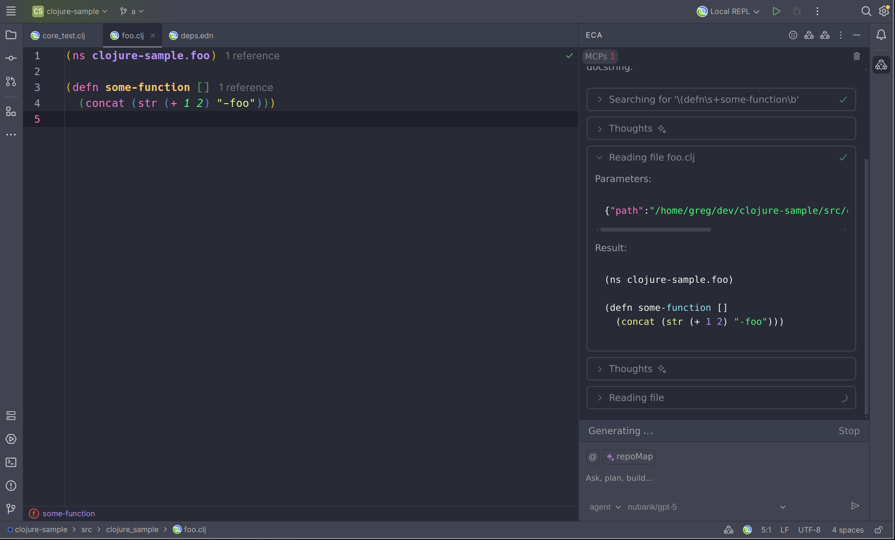

# ECA Intellij

<!-- Plugin description -->

[Free OpenSource Intellij plugin](https://github.com/editor-code-assistant/eca-intellij) with support for AI pair programming via [ECA](https://eca.dev)

<!-- Plugin description end -->

---

## Settings

Go to Preferences > Tools > ECA.

## Development

`bb install-plugin <pathToYourIntellij>` to install the plugin locally.

or

`bb build-plugin` to manually install via intellij the .zip.
